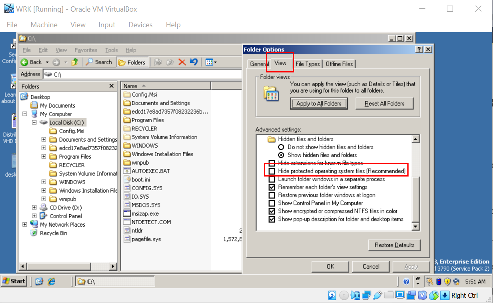
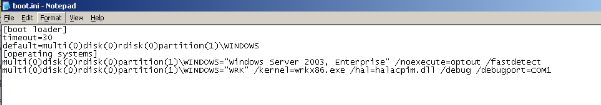
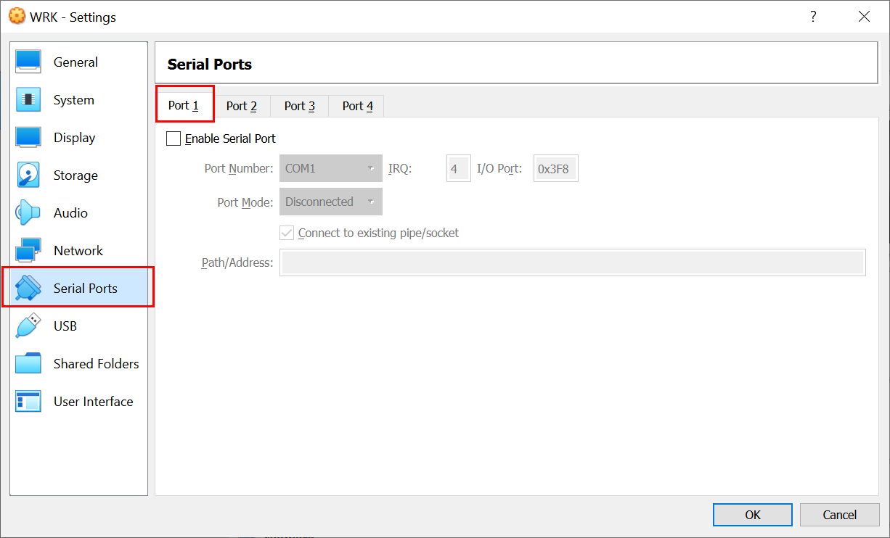
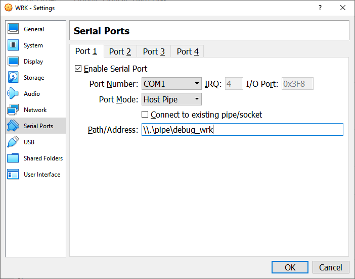
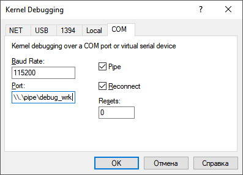
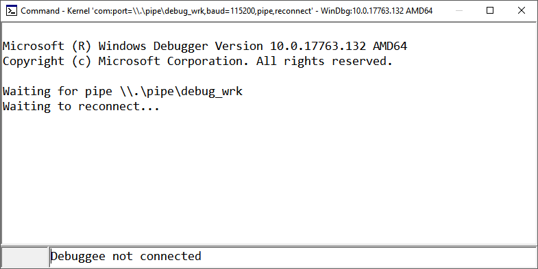
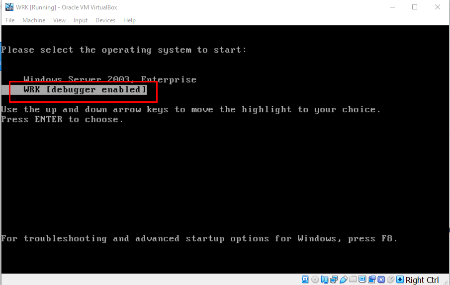
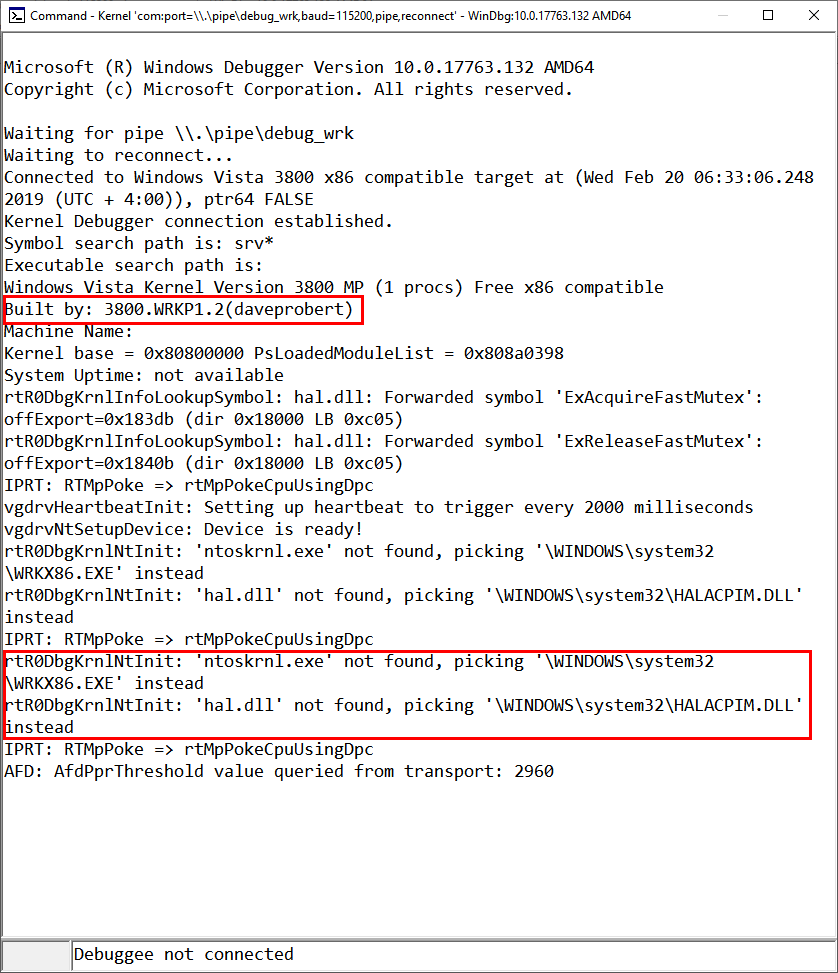

# 01. Сборка и установка ядра WRK

## Цель 
Научиться: 
- компилировать ядро из пакета Windows Research Kit (WRK)
- устанавливать его на виртуальной машине с Windows 2003
- настраивать запуск Windows 2003 c ядром WRK в режиме отладки
- подключаться отладчиком из пакета Windows Debugging Tools к ядру

## Необходимые нструменты

- пакет WRK
- виртуальная машина c Windows 2003 
- пакет Windows Debugging Tools

## Практика

### Получение и компиляция ядра WRK

1. Скопируйте данный репозиторий на локальную машину

``` cmd
git clone https://github.com/MihailRomanov/OS_Course
```

2.  Перейдите в подпапку **Resources\\WRK\\WRK-v1.2** и выполните команду

``` cmd
Build.bat x86
```

3. После окончания сборки перейдите в папку **Resources\\WRK\\WRK-v1.2\\base\\ntos\\BUILD\\EXE** и убедитесь, что там появились файлы:

- wrkx86.def
- **wrkx86.exe**
- wrkx86.exp
- wrkx86.lib
- wrkx86.map
- wrkx86.pdb

### Установка ядра и настройка запуска 

1. Запустите виртуальную машину с Windows 2003 и авторизуйтесь на ней под администратором

2. Скопируйте файлы

- Resources\\WRK\\WRK-v1.2\\base\\ntos\\BUILD\\EXE\\wrkx86.exe
- Resources\\WRK\\WRK-v1.2\\WS03SP1HALS\\x86\\halacpim\\halacpim.dll

в папку **c:\\Windows\\System32** на гостевой Windows 2003

Это можно сделать, например, так:
- перетащить файлы (Drag&Drop) на рабочий стол гостевой машины
- выделить их на рабочем столе и скопировать
- открыть через меню **Start** Windows Explorer
- перейти в нем на **c:\\Windows\\System32** и вставить скопированные файлы

3. Откройте на редактирование файл c:\\boot.ini на гостевой ОС. Для этого: 

- в Windows Explorer перейдите на корень диска C:\
- откройте меню **Tools\\Folder Options...**
- на закладке **View** снимите галочку **Hide protected operating system files**



- в свойствах файла **boot.ini** снимите галочку **Read only** 

4. Вставьте в конец файла **boot.ini** следующую строку:

```
multi(0)disk(0)rdisk(0)partition(1)\WINDOWS="WRK" /kernel=wrkx86.exe /hal=halacpim.dll /debug /debugport=COM1
```



Сохраните и закройте файл.

5. Выключите (**Start\\Shut Down**) виртуальную машину


### Настройки отладочного COM-порта

1. Откройте настройки виртуальной машины, перейдите на раздел **Serial Ports** и вкладку **Port 1**



2. Установите следующие значения полей на вкладке:

|Поле|Значение|
|-|-|
|**Enable Serial Port**|_Включено_|
|**Port Number**|COM1|
|**Port Mode**|Host Pipe|
|**Connect to exisiting pipe/socket**|_Выключено_|
|**Path/address**|\\\\.\\pipe\\debug_wrk|

и нажмите **OK**



### Настройка и подключение отладчика WinDbg

1. Запустите **WinDbg** (x64 или x86)
2. Запустите отладчик ядра:

- откройте диалог **File/Kernel Debug...**
- перейдите на закладку **COM**
- заполните поля диалога 

|Поле|Значение|
|-|-|
|**Pipe**|_Включено_|
|**Reconnect**|_Включено_|
|**Port**|\\\\.\\pipe\\debug_wrk|



Нажмите **OK**, обратите внимание на открывшееся окно ожидания соединения:



3. Запустите виртуальную машину Win2003 и выберите в меню загрузки пункт **WRK**



Отследите в окне отладчика, что произошло подключение (и какой выбран образ ядра и HAL):




