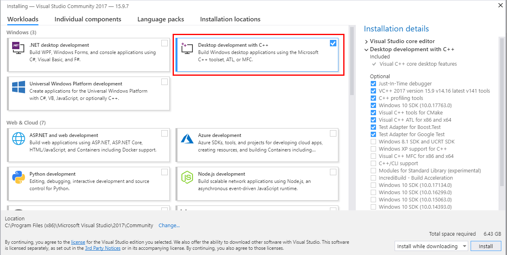

# Что нужно установить/скачать

- **[Visual Studio 2017](https://visualstudio.microsoft.com/thank-you-downloading-visual-studio/?sku=Community&rel=15)**
  - При установке обязательно выбрать 
    - Desktop development with C++

- **[VirtualBox](https://www.virtualbox.org/wiki/Downloads)** последней версии

- Файлы **[msvcp71.dll](https://www.dll-files.com/msvcp71.dll.html)** и **[msvcr71.dll](https://www.dll-files.com/msvcr71.dll.html)**
  - их нужно скопировать в каталог **C:\Windows\SysWow64** на хостовой машине (они используются системой компиляции WRK - без них компиляция проходит, но результат сборки будет некорректен).

- **Debuging Tools for Windows** Они являются частью пакета [Windows 10 SDK](https://developer.microsoft.com/en-us/windows/downloads/windows-10-sdk)
  - при установке нужно выбрать соответствующий пункт **Debuging Tools for Windows**: 

  - после скачивания пройти по пути **C:\Users\<user>\Downloads\Windows Kits\10\WindowsSDK\Installers** и запустить установщик **SDK Debuggers-x86_en-us.msi**

- **[Windows Server 2003 Evaluation Edition](https://www.microsoft.com/en-us/download/details.aspx?id=19727)**
  - нужно скачать все четыре части архива, распаковать и взять только образ виртуального жесткого диска (*.vhd)

